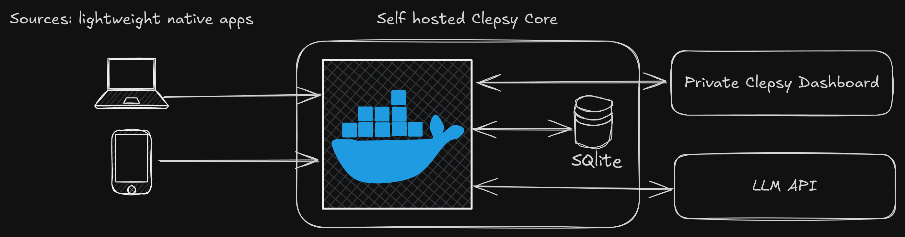

# Welcome to Clepsy

	

> ⚠️ **Alpha Software** - Clepsy is currently in alpha. Expect breaking changes and rough edges.

Clepsy is a self-hosted automated time tracking application. The goal is to make time tracking
effortless by removing the constant need for manually adding, categorizing and toggling activities.
It works by monitoring your devices, having a LLM process all the information and form tailored timelines which you can later view in the accompanying dashboard. The system is fully self hostable and can be fully private if you choose to self host the LLM as well.

## Features

1. Automated activity detection
2. Automated tagging of activities by fully customizable tags
3. Productivity assignments for each activity, based on your own criteria
4. Unified tracking of computer & mobile activities, with plans for further expansion
5. Set goals based on productivity, time spent per tag etc.
6. Gain insights into your productivity, how you spend your time, distraction patterns and more.
7. Optionally supplement automated activities manually to get a more complete picture
8. PII redaction of text before it is sent to the LLM
9. Fully customizable LLM provider (Google, Anthropic, OpenAI, OpenAI compatible etc)

## Deployment

[See setup guide](docs/SETUP.md)

## Architecture

A Clepsy deployment consists of a backend and one or more **Sources**. Sources are small native apps for mobile or desktop that, once paired with the backend, run in the background and monitor active applications. They send this information to the backend, which communicates with an LLM to create meaningful timelines and categorizations. All data is persisted in a local SQLite database and displayed through the web UI. The backend is a simple docker service that may be self hosted on any VPS.

The backend needs to be exposed to the internet for sources to communicate with it from your devices and so you can access the web UI from anywhere. This can be done securely with a domain and TLS certificates or via a secure tunnel such as Tailscale.

## Privacy

Given the potentially sensitive information the system monitors, privacy must be taken very seriously. Data is encrypted when being sent from sources to the backend, and the backend is only accessible by you with your password. The only time any of your data leaves your deployment is if you use an external LLM. If you choose to self-host your own LLM, the whole system is fully private.

### What does the LLM see?

**Desktop:** By default on desktop the LLM sees OCR derived text from your open application, the title of the window and the name of the application. Alternatively, instead of OCR the screenshot can be sent directly to the configured VLM, this may be preferable if the text is often not sufficient context for creating correct timelines.

**Mobile:** On mobile the LLM sees application name, title, title of any playing media and attached notifications. It does not see the contents of the app itself as that requires root access.

### PII Removal

Basic PII removal via [Gliner-PII](https://huggingface.co/knowledgator/gliner-pii-base-v1.0) is applied to
any potentially sensitive text before being sent to the LLM. Not to be depended on but will catch most sensitive info like api keys, passwords etc. before they reach the LLM.

## Tech Stack

**Backend:** FastAPI • SQLite • Goose • Dramatiq • APScheduler • Valkey

**Frontend:** [htpy](https://htpy.dev/) • HTMX • Alpine.js • TailwindCSS • [Basecoat UI](https://basecoatui.com/) • D3.js

**LLM & AI:** [BAML](https://github.com/BoundaryML/baml) • PaddleOCR • GLiNER

**Infrastructure:** Docker • Caddy • uv • Prometheus • Grafana

## License

This project is dual-licensed:

- **Open Source License:** GNU Affero General Public License v3.0 (AGPL-3.0) for open source use. See the [LICENSE](LICENSE) file for details.
- **Commercial License:** For commercial licensing options please contact [sam@clepsy.ai](mailto:sam@clepsy.ai).

**Copyright © 2025 Samouil Galanakis. All rights reserved.**
